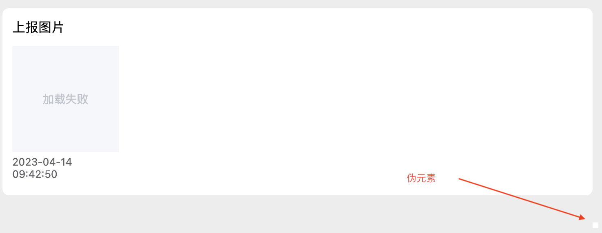

# 记滚动条伪元素处理问题

## element-ui scroll-bar 样式入侵问题 
样式存在overflow: scroll时，受到全局样式的影响会添加scrollbar的占位样式
如果该元素是设置了宽度或者高度占满，则该属性会收到scrollbar的影响导致样式错误的问题。同时如果元素使用了背景色透明背景色会出现滚动条角落伪元素突出的问题

## 示例图片

## Link
[scroll-bar 伪元素](https://juejin.cn/post/7139049177656819749)
