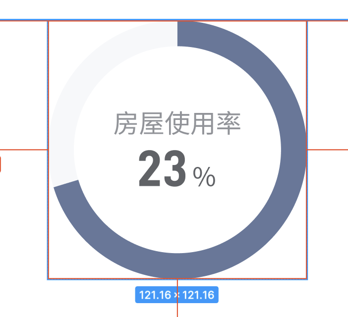

在现在的开发页面的过程中，一般比较少会直接去写svg元素而是使用封装好的组件。但是今天遇到的需求是写一个圆环，索性看下文档学习下如何原生开发一个圆环svg。

## 需求示意图


## 完成效果


## 开发要点
1. 注意`circle`元素的x、y坐标与`svg`元素的宽高
2. 圆环核心的样式主要是依赖`circle`的间距属性宽度、间距颜色进行实现，注意两个环各自的颜色
3. 如果要展示出圆环进度的效果主要依赖`stroke-dasharray: 50 284`来实现，`50 / 284`就是展示出来的圆环进度，`284`这个值这是通过圆环的周长计算出来的。背后的解释说明建议看链接2
4. `transform`属性的是用来改变进度环的起始位置

## 参考代码
```html
<svg width="200" height="200">
      <circle
        cx="100"
        cy="100"
        r="45"
        stroke-width="10"
        stroke="#65789b0d"
        fill="none"
      ></circle>
      <circle
        cx="100"
        cy="100"
        r="45"
        stroke-width="10"
        stroke="#65789b"
        fill="none"
        transform="matrix(0,-1,1,0,0,200)"
        stroke-dasharray="50 284"
      ></circle>
  </svg>
```

## link
[svg 实现 css 圆环](https://juejin.cn/post/6844903895135682574)

[stroke相关属性学习](https://www.cnblogs.com/daisygogogo/p/11044353.html)
